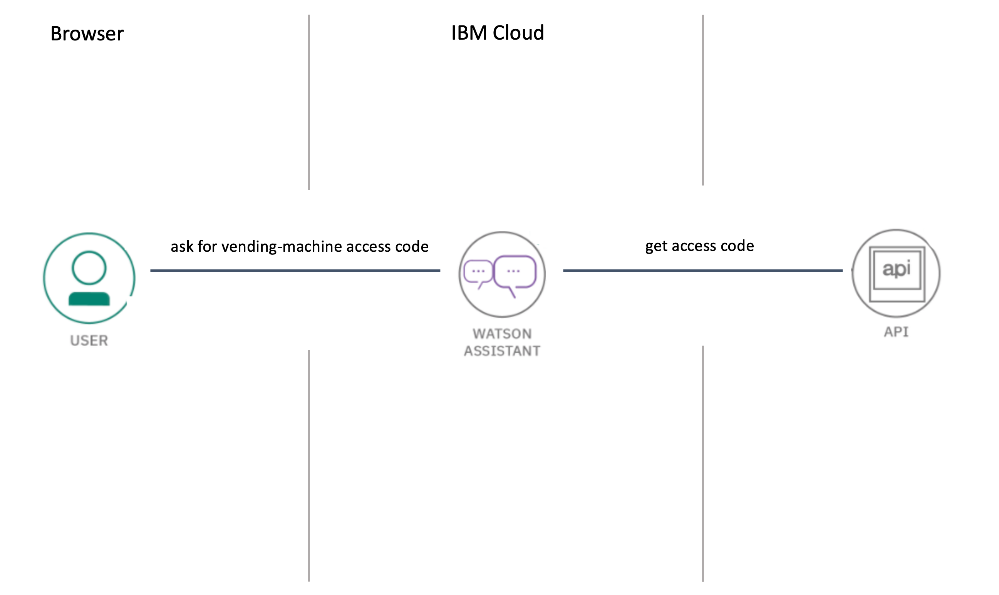

## Instructions: Get your code for the vending machine!

This instruction does demonstrate how to setup and use the **IBM Watson Assistant Service** on **IBM Cloud** to get your access code for the vending machine.

### Architecture

We use IBM Watson Assistant and an external API to get the access code for the vending machine, as shown in the image below.

> Find out more Watson Assistant and Chat Bot on [IBM Developer](https://developer.ibm.com/technologies/artificial-intelligence/tutorials/create-your-first-assistant-powered-chatbot/).

### Estimated time and level

|  Time | Level  |
| - | - |
| 10 - 15 min | beginners |

### Objectives

After you complete this instruction, you'll understand the following topics:

* Create an instance of IBM Watson Assistant on IBM Cloud. 
* Add a customized dialog skill to IBM Watson Assistant
* Use a chat-bot to get your access-code for the vending machine.

### Agenda

These are the sections of the instructions, go through all of them in sequence, start with `Pre-work` :

 1. [Pre-work](pre-work/README.md) 
 2. [Create a Watson Assistant Service instance on IBM Cloud](exercise-01/README.md) 
 3. [Import a dialog-skill](exercise-02/README.md) 
 4. [Run the chat-bot and get your code for the vending-machine](exercise-03/README.md) 

### Compatibility

These insturctions have been tested on the following platforms:

* **IBM Watson Assistant Service (Lite)** on IBM Cloud

### Credits

* [Herwig Diessner]()
* [Thomas Südbröcker](https://twitter.com/tsuedbroecker)

