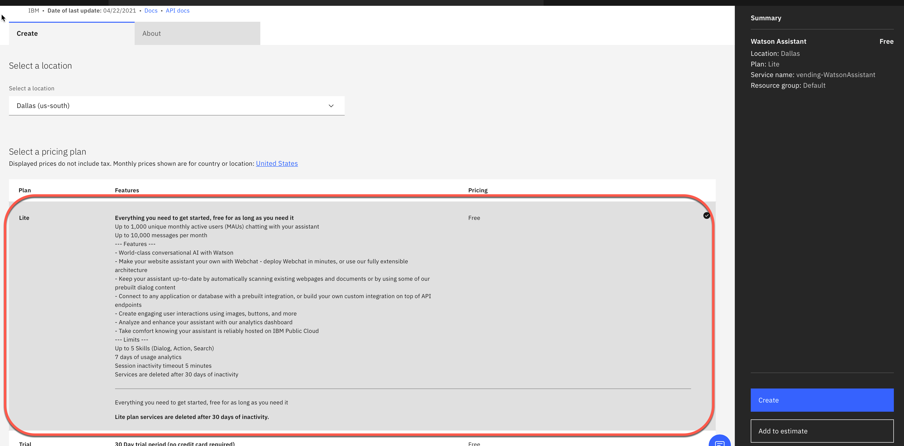
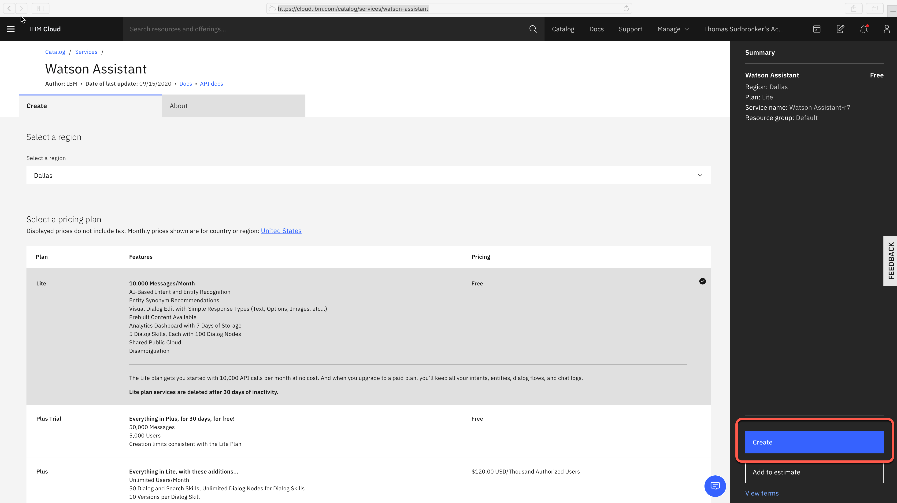

# Step 1: Create a Watson Assistant Service instance on IBM Cloud

### Step 1: Login to IBM Cloud

### Step 2: Open catalog

* Use following link [https://cloud.ibm.com/catalog/services/watson-assistant](https://cloud.ibm.com/catalog/services/watson-assistant)

### Step 3: Change the service name to `vending-WatsonAssistant`

### Step 4: Press create

### Step 5: Press `Launch Watson Assistant`

### Step 6: Select `Assistants`

### Step 7: Press `Create assistant`

### Step 8: Name the Assistant `Vending-Assistant`

Ensure Enable `preview link` is selected.

### Step 9: Press `Create assistant`

---