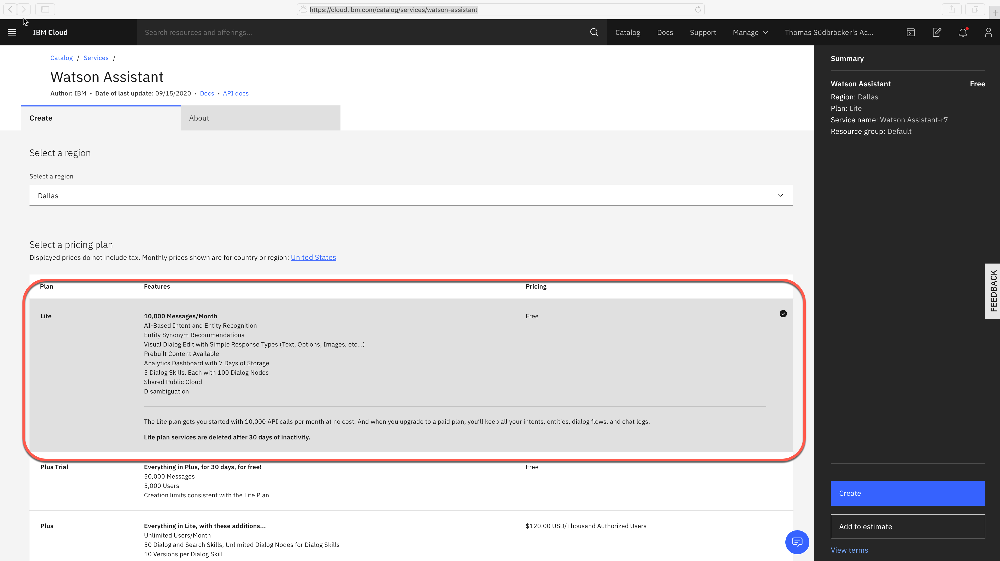
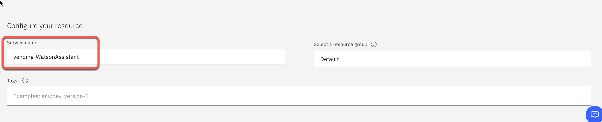
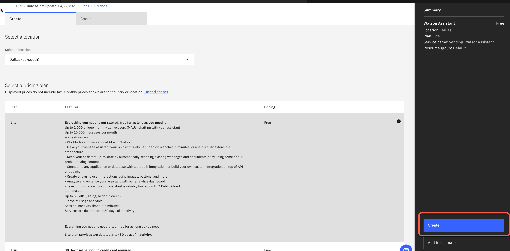
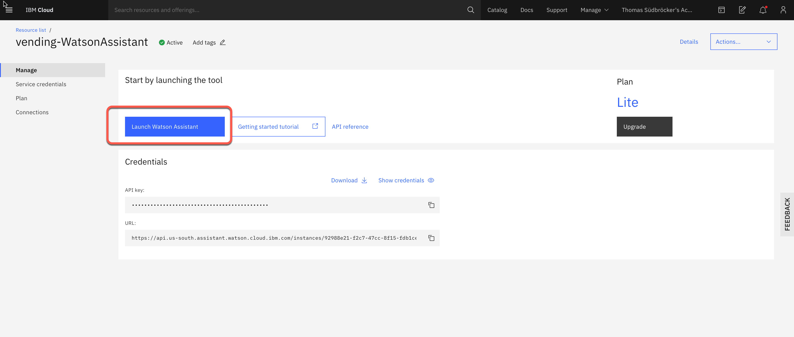
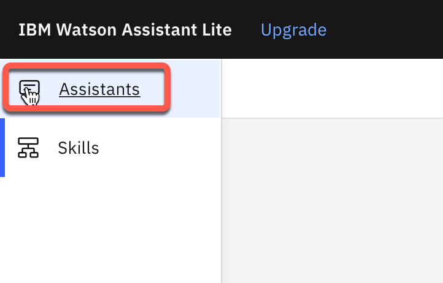
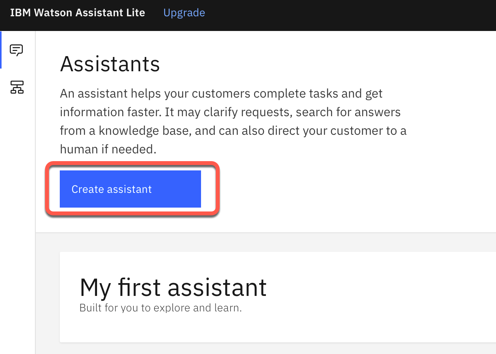
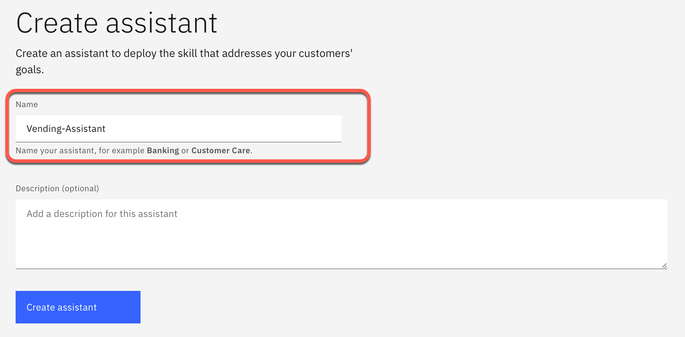
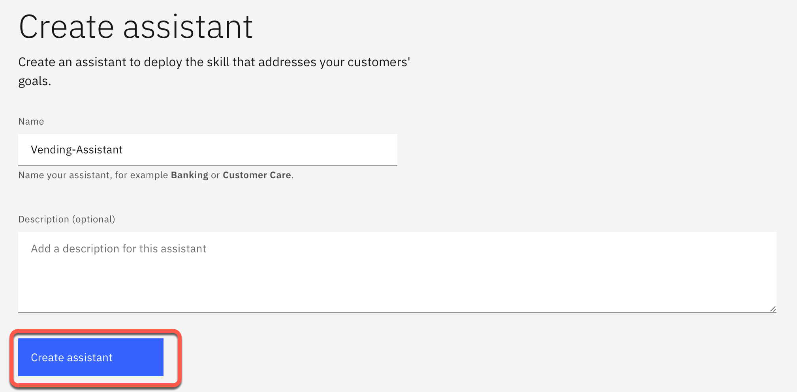

# Step 1: Create a Watson Assistant Service instance on IBM Cloud

## Step 1: Login to IBM Cloud

Go to the following link [https://cloud.ibm.com](https://cloud.ibm.com) and log in.

## Step 2: Open catalog

Use following link [https://cloud.ibm.com/catalog/services/watson-assistant](https://cloud.ibm.com/catalog/services/watson-assistant)

## Step 3: Change the service name to `vending-WatsonAssistant`

Insert `vending-WatsonAssistant`

## Step 4: Press `Create`

## Step 5: Press `Launch Watson Assistant`

## Step 6: Select `Assistants`

## Step 7: Press `Create assistant`

## Step 8: Name the Assistant `Vending-Assistant`

## Step 9: Press `Create assistant`

---
