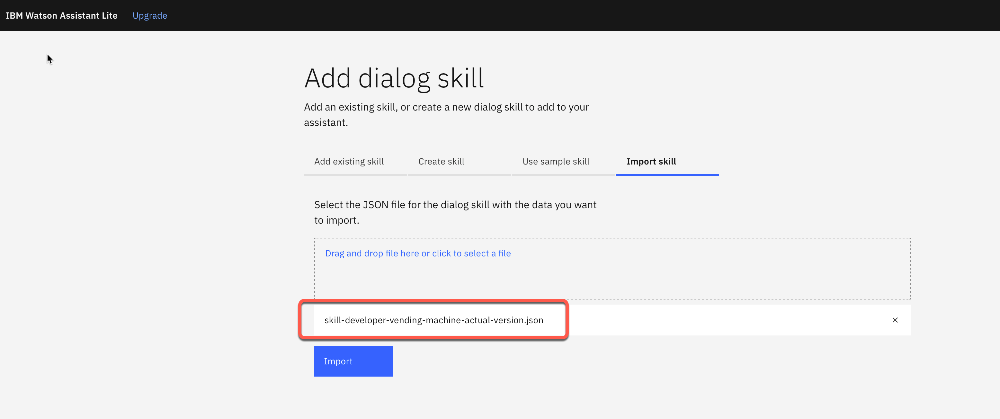

# Step 2 - Import a dialog-skill

## Step 1: Select `Add dialog skill` (ensure you select **dialog skill**)

## Step 2: Select `Upload skill` tab

## Step 3: Open following link in a new browser tab

[https://github.com/thomassuedbroecker/vending-dialog-skill](https://github.com/thomassuedbroecker/vending-dialog-skill)

## Step 4: Select `Code` and then `Download zip`

## Step 5: Extract the zip file on your local machine

## Step 6: Drag and drop the file `skill-developer-vending-machine-actual-version.json` for the import

## Step 7: Press `Import`

---
