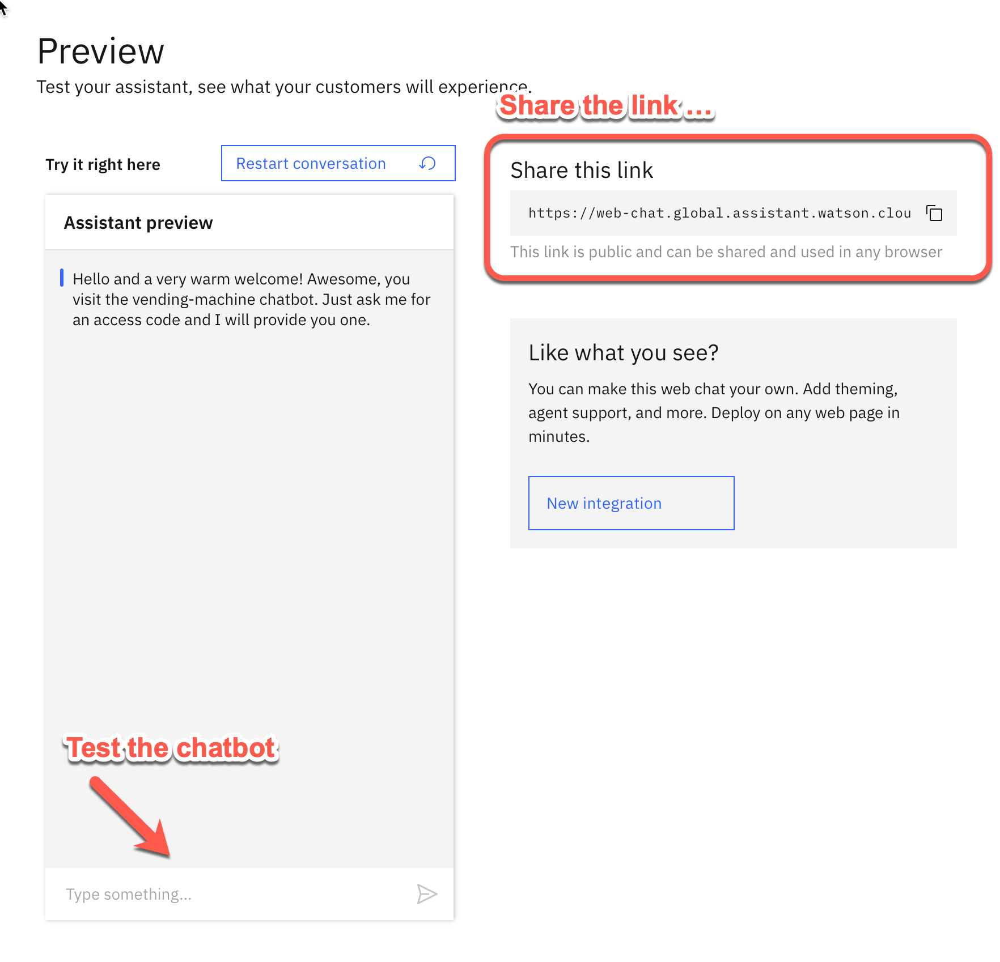

# Step 3: Run the chat-bot and get your code for the vending-machine

## Step 1: Click `Preview`

## Step 2: Now you can use the assistant

You can also share the `preview/test` link to share with stakeholders of your chatbot. 

## Step 3: Ask for the vending machine code

---

> **Congratulations** you have finished the **Instructions**  to get the code.

---

> Find out more about **IBM Watson Assistant** and **chatbot** on [IBM Developer](https://developer.ibm.com/technologies/artificial-intelligence/tutorials/create-your-first-assistant-powered-chatbot/).
