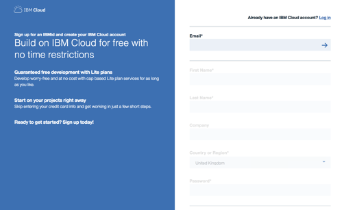

# Register for IBM Cloud

## Step 1: Open a browser window and navigate to the IBM Cloud [Registration page](https://ibm.biz/Bdqu4M)

## Step 2: Fill in the registration form and follow the link in the **confirmation email** to confirm your account once it arrives

## Step 3: [Login into IBM Cloud](https://ibm.biz/Bdqu4M) using your account credentials

By default, all new [IBM Cloud accounts](https://cloud.ibm.com/docs/account?topic=account-accounts) are set to a [PayAsYouGo](https://www.ibm.com/cloud/pricing).

---
