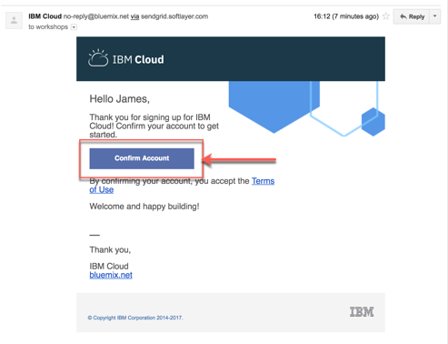

# Register for IBM Cloud

### Step 1: Open a browser window and navigate to the IBM Cloud [Registration page](https://ibm.biz/Bdqu4M).

### Step 2: Fill in the registration form and follow the link in the **confirmation email** to confirm your account once it arrives.

### Step 3: [Login into IBM Cloud](https://ibm.biz/Bdqu4M) using your account credentials.

By default, all new IBM Cloud accounts are set to a [lite](https://www.ibm.com/cloud/pricing). The lite account provides free access to a subset of IBM Cloud resources. Lite accounts **don't need a credit-card** to sign up and they **don't expire** after a certain period of time.

---
